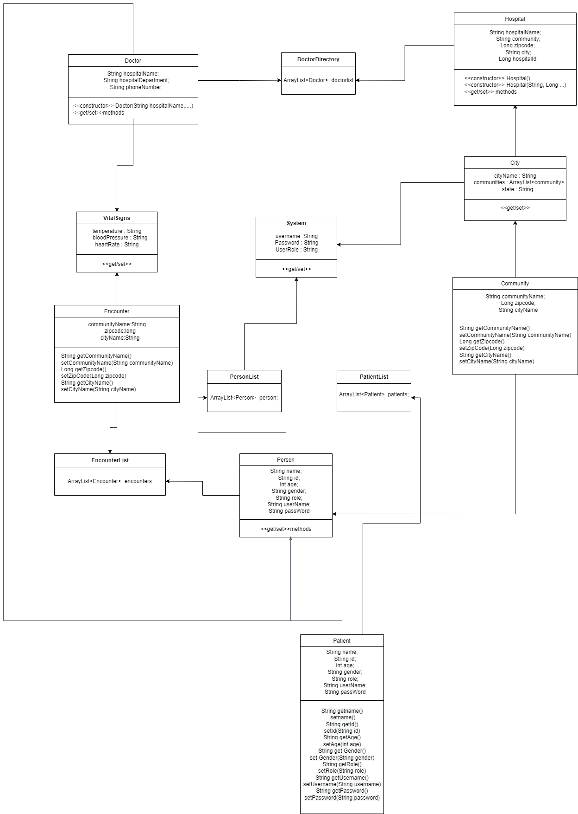

# Introduction
1. Name: Poddaturi_Anutej_002922161
2. NUID: 002922161
3. Email: poddaturi.a@northeastern.edu

# About the Repo

This repo is for INFO 5100 assignments, as part of the assignment 2 we are creating a Swing application which is a hospital management system.

# Replication

To run the project clone the project locally and open it in the apache netbeans or any ide.

After Opening it an IDE we can run it and see the application.

To clone you need to change to the directory in bash and run the below command:

``` git clone https://github.com/apoddaturi/Poddaturi_Anutej_002922161.git ```

# Operations 

Using the application we are able to perform following operations:


# UML Diagrams

## Sequence Diagrams

1. Person:


2. Doctor:


# Class Diagram

